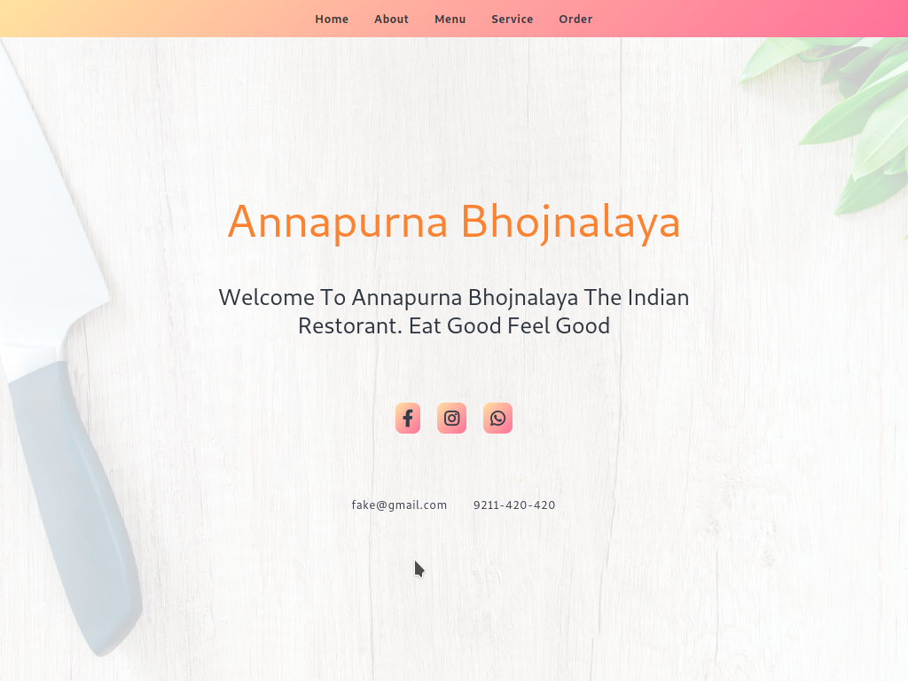

# website-5

- Name : "Annapurna Bhojnalaya"

- Description : "Vegetarian Food Restorant"

- Version : main

- Update : 12-03-2024

- Status : REST

- Responsive : True

- TechStack : { HTML | CSS | JavaScript | PHP }

- Thanks : { GitHub | VSCodium | Unplash | Favicon }

- Collabrate : { Self }

- URL : https://username.github.io/Annapurna/

- Clone : https://github.com/username/Annapurna.git

- Download : https://github.com/username/annapurna/archive/refs/heads/main.zip

#### Project Look & Feel

#### Responsive

_""_

  **SCREEN** { 1200PX | 992PX | 785PX | 556PX }

#### Theme

_"orange colour scheme with light theme"_

#### Key Feature that make website more valuble

 - [x] Single webpage website
 - [X] PHP scripting
 - [x] Database storage

#### Requirement to use

-  PHP _server_ & space
-  Set _database_ & _table_
-  Reset Connection.php

### Warning

** normal copyright **

__" Please refrain from unauthorized coping or downloading of content, as such actions are subject to legal consequences and potential charges.We encourage respectful and responsible use of the resouces prvided for learning purpose."__

